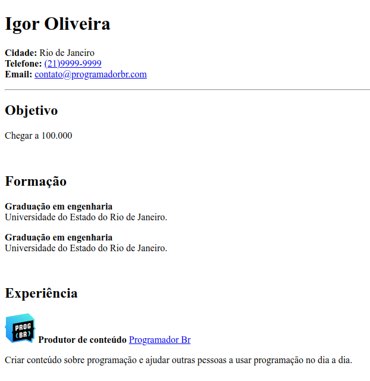

# 📄 Currículo em HTML

Este projeto foi desenvolvido como parte do curso **ProgramadorBR - Full Stack Web**.

## 🧾 Descrição

Desafio prático para criação de um currículo utilizando apenas **HTML5**, sem estilizações externas.

## 🔧 Tecnologias Utilizadas

- HTML5

## 📸 Captura de Tela



## 🔗 Visualização ao Vivo

Acesse o currículo online: [Currículo HTML](https://vieirarodrigo.github.io/curriculo-html/)

## 🚀 Como Executar Localmente

1. Clone o repositório:
   ```bash
   git clone https://github.com/vieirarodrigo/curriculo-html.git
